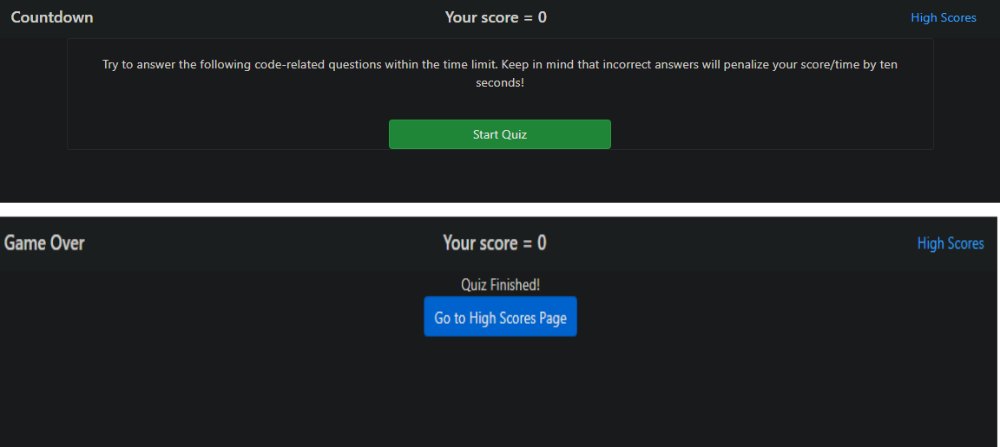
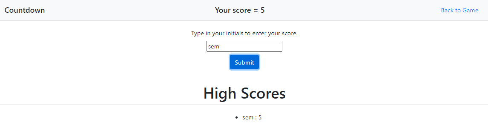
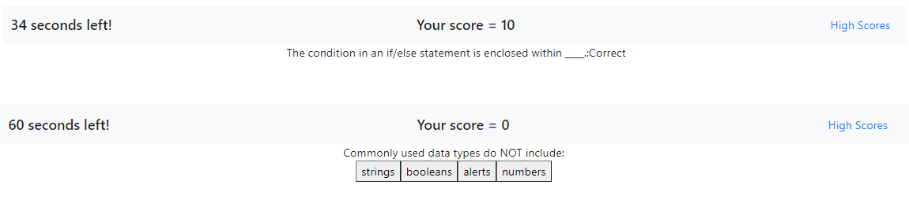

# TimedCodingQuiz
# 04 Web APIs: Code Quiz

Acceptance Criteria / Goals for assignment:

*Create a timed coding quiz.
*When a start button is clicked, a timer starts, and a question is presented.
*When a question is answered, another question is presented.
*When a question is answered incorrect, then time is subtracted from the countdown clock.
When all questions are answered or the countdown clock reaches 0, then the game is over.
When the game is over, the player saves his/her initials and score to a high scores board.

Reflections:

I learned:
1) To better navigate functions in JavaScript.
2) How to better reference objects in an array.
3) How to locally store data.
4) That the order of the code is super important; I fixed many small mistakes along the way by taking correct code that wasn't working and moving it to the appropriate location in the code block.
5) That flow of the submit buttons is important once multiple users are working on the same thing.
6) How to store items to an array in local storage and then pull data from the local storage array to put into text on the page.

Deployed Site:  https://smanter82.github.io/TimedCodingQuiz/

Code done in collaboration with Wednesday and Saturday study group:  https://github.com/shannonquinn91/Coding-Quiz, https://github.com/dmaysteinman/Code_Quiz, https://github.com/mdjonestwo, Brenda Burns, https://github.com/Ewager1, Jesal Mehta
